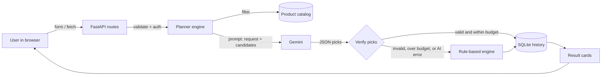

<div align="center">

# PocketSmart AI

### Your Smart Budget & Recommendation Assistant

Tell it your budget. Gemini picks the products. Code proves the plan never goes over.


Naan Mudhalvan &middot; Google Cloud Generative AI track

</div>

---

## Table of contents

1. [What is PocketSmart AI?](#1-what-is-pocketsmart-ai)
2. [Demo](#2-demo)
3. [Features](#3-features)
4. [How it works](#4-how-it-works)
5. [Tech stack](#5-tech-stack)
6. [Project structure](#6-project-structure)
7. [Quick start](#7-quick-start)
8. [Configuration](#8-configuration)
9. [Using the app](#9-using-the-app)
10. [API reference](#10-api-reference)
11. [The AI layer in depth](#11-the-ai-layer-in-depth)
12. [The budget engine (fallback)](#12-the-budget-engine-fallback)
13. [Database](#13-database)
14. [Security](#14-security)
15. [Testing](#15-testing)
16. [Troubleshooting](#16-troubleshooting)
17. [Limitations](#17-limitations)
18. [Roadmap](#18-roadmap)
19. [Documentation set](#19-documentation-set)
20. [Author](#20-author)

---

## 1. What is PocketSmart AI?

PocketSmart AI is a web application that turns a budget and a few preferences into a concrete shopping plan.

Planning a purchase usually means opening many shopping sites, comparing prices, and adding numbers in your head. It is easy to overspend or forget something (a party needs a venue **and** food **and** decor). PocketSmart does that planning in one place, for three everyday situations:

| Planner | You provide | You get |
|---|---|---|
| **Home Interior** | Room, style, number of rooms, budget | Furniture, decor and lighting that fit the budget |
| **Party** | Event type, guest count, veg-only, budget | A venue, food priced per guest, and decor |
| **Jewelry** | Occasion, style, outfit text, optional outfit photo, budget | Jewelry matched to the occasion and outfit |

The design idea is simple: **AI proposes, code disposes.** Google Gemini chooses from a fixed list of candidate products and explains each choice. The backend then verifies the answer (real products only, total within budget). If Gemini is unavailable, a built-in rule-based engine produces the plan instead, so the user always gets a valid result.

## 2. Demo

- Walkthrough video: [`PocketSmart_Demo.mp4`](PocketSmart_Demo.mp4) (register, login, all three planners, validation, history, API docs, logout).
- Screenshots: [`docs/screenshots`](docs/screenshots)

> The bundled video was recorded in an environment without Gemini access, so it shows the rule-based fallback badge. With a valid API key the result badge reads **Gemini AI** and shows the model used.

## 3. Features

**Accounts and sessions**
- Register, login and logout with server-side validation
- Passwords stored as salted PBKDF2-SHA256 hashes
- JWT login stored in an HttpOnly cookie, plus a `/token` endpoint for API clients

**Planners**
- Home, Party and Jewelry planners with dedicated forms
- Jewelry accepts an optional outfit image (JPG, PNG or WEBP, up to 5 MB) for a multimodal Gemini prompt
- Quantities and guest counts are handled correctly (per-room and per-person pricing)

**AI and reliability**
- Gemini text and text+image prompts returning structured JSON
- Model fallback chain: primary model, then backup models
- Every AI answer is verified before it is shown: unknown product ids are dropped, and picks are trimmed until the total is within budget
- Rule-based fallback when AI fails for any reason

**User experience**
- Card layout with price, platform, reason and a search link for every pick
- Budget usage bar, planned total and money left over
- JavaScript sorting (price low/high) and platform filtering without page reloads
- Dashboard and full recommendation history; reopen any past plan
- Clear error messages for bad input; responsive layout and dark-mode aware styling

## 4. How it works



Step by step for one request, for example `POST /generate-home`:

1. **Authenticate.** The route requires a valid login (cookie or Bearer token).
2. **Validate.** Pydantic checks the input: budget range, allowed rooms and styles, quantity and text length. Bad input returns HTTP 422 with a readable message.
3. **Shortlist.** The catalog is filtered to items that match the request (room, event, occasion, capacity, veg-only).
4. **Ask Gemini.** The prompt contains the request, the shortlist with prices, the rules, and the exact JSON format to reply with. For jewelry, the outfit image is attached.
5. **Verify.** Unknown ids and duplicates are dropped. If the total is over budget, items are removed from the end until it fits. If nothing valid remains, the fallback is used.
6. **Save.** The request and the result are stored in the user's history.
7. **Show.** The browser opens `/history/{id}`, which renders the result as cards.

## 5. Tech stack

| Layer | Technology | Purpose |
|---|---|---|
| Language | Python 3.10+ | Backend logic |
| Web framework | FastAPI + Uvicorn | Routes, validation, automatic API docs |
| Templates | Jinja2 | Server-rendered HTML pages |
| Frontend | HTML, CSS, vanilla JavaScript | Forms, `fetch`, sorting and filtering |
| AI | Google Gemini via the `google-genai` SDK | Product selection and explanations, text + image |
| Database | SQLite (`sqlite3`) | Users and history |
| Auth | PyJWT, PBKDF2 (`hashlib`) | Tokens and password hashing |
| Validation | Pydantic, Pillow | Input models and image checks |
| Testing | pytest, httpx | 30 automated tests |

## 6. Project structure

```
PocketSmart-AI/
├── app/
│   ├── main.py              # FastAPI app: startup, CORS, static files, error handlers
│   ├── config.py            # Settings loaded from .env
│   ├── auth.py              # Password hashing, JWT, current-user dependencies
│   ├── database.py          # SQLite tables and queries
│   ├── gemini_service.py    # Gemini calls (text + image), JSON parsing, model fallback
│   ├── planners.py          # Request models, prompts, verification, rule-based engine
│   ├── products.py          # Simulated product catalog
│   ├── templating.py        # Jinja2 setup and render helper
│   └── routes/
│       ├── public_routes.py   # /, /testimonials, /health
│       ├── auth_routes.py     # /register /login /logout /token /session-info /session-data
│       └── planner_routes.py  # /generate-* /recommendations-details /history + pages
├── templates/               # 16 HTML templates (pages + shared result cards)
├── static/
│   ├── css/style.css
│   └── js/app.js
├── tests/test_app.py        # 30 automated tests
├── scripts/test_gemini.py   # Live Gemini connectivity check (text + image)
├── docs/screenshots/        # UI screenshots
├── .env.example             # Configuration template (copy to .env)
├── requirements.txt
└── *.md                     # Project documentation (see section 19)
```

## 7. Quick start

Requirements: Python 3.10 or newer, and a free Gemini API key from [Google AI Studio](https://aistudio.google.com/apikey).

```bash
# 1. Get the code and enter the folder
git clone https://github.com/Mukilkani23/PocketSmart-AI.git
cd PocketSmart-AI

# 2. Create and activate a virtual environment
python -m venv .venv
# Windows (PowerShell):  .venv\Scripts\Activate.ps1
# macOS / Linux:         source .venv/bin/activate

# 3. Install dependencies
python -m pip install -r requirements.txt

# 4. Configure (see section 8)
#    Windows: copy .env.example .env      macOS/Linux: cp .env.example .env
#    then open .env and set GEMINI_API_KEY

# 5. Check that Gemini works (text and image)
python scripts/test_gemini.py

# 6. Run the app
python -m app.main
```

Open **http://127.0.0.1:8000**. Interactive API docs are at **http://127.0.0.1:8000/docs**.

> On Windows machines with restricted policies, use `python -m pip ...` instead of `pip ...`.

## 8. Configuration

Copy `.env.example` to `.env`. The `.env` file is in `.gitignore`; never commit it.

| Variable | Meaning | Default |
|---|---|---|
| `GEMINI_API_KEY` | Your Google AI Studio API key. If empty, the app runs with rule-based recommendations only | empty |
| `GEMINI_MODEL` | First model to try | `gemini-3.5-flash` |
| `GEMINI_FALLBACK_MODELS` | Comma-separated models tried next | `gemini-3.5-flash-lite,gemini-2.5-flash` |
| `SECRET_KEY` | Secret used to sign login tokens. Use a long random string | insecure dev value |
| `ACCESS_TOKEN_EXPIRE_MINUTES` | Login lifetime | `120` |
| `DATABASE_PATH` | SQLite file location | `pocketsmart.db` |

Google renames and retires models regularly. If a model stops working, pick a current one from the [models page](https://ai.google.dev/gemini-api/docs/models) and update `GEMINI_MODEL`.

## 9. Using the app

1. **Register** an account, then **log in**.
2. Open the **Dashboard** and choose a planner.
3. Fill the form and submit. Results appear as cards with a budget bar.
4. Use **Sort** and **Platform** to reorder or filter cards.
5. Open **History** to reopen any earlier plan.

Example inputs to try:

| Planner | Input | What to expect |
|---|---|---|
| Home | Bedroom, modern, 1 room, ₹45,000 | Bed, mattress, lamp, curtains and more, total at or under ₹45,000 |
| Party | Birthday, 30 guests, ₹40,000, veg only | Venue + veg buffet (price × 30) + decor within budget |
| Jewelry | Wedding, traditional, green silk saree photo, ₹9,000 | An outfit analysis and matching pieces within budget |

## 10. API reference

Protected endpoints need a login cookie or an `Authorization: Bearer <token>` header. Get a token from `/token`.

| Method | Path | Auth | Description |
|---|---|---|---|
| GET | `/` | no | Landing page |
| GET | `/testimonials` | no | Testimonials page |
| GET | `/health` | no | Status, whether a Gemini key is configured, primary model |
| GET / POST | `/register` | no | Registration page / create account |
| GET / POST | `/login` | no | Login page / authenticate and set cookie |
| GET / POST | `/logout` | no | Clear session, redirect to login |
| POST | `/token` | no | OAuth2 password form → `{access_token, token_type}` |
| GET | `/session-info` | optional | `{logged_in, user_id, username}` |
| GET | `/session-data` | yes | Member since, total recommendations, counts by category, last plan |
| POST | `/generate-home` | yes | JSON: `room, style, quantity, budget, notes` |
| POST | `/generate-party` | yes | JSON: `event_type, guests, veg_only, budget, notes` |
| POST | `/generate-jewelry` | yes | Multipart: `occasion, style, outfit, budget, notes, image?` |
| GET | `/recommendations-details` | yes | Query: `category, budget, preference` for a quick detailed plan |
| GET | `/history` | yes | Your past recommendations (JSON list) |
| GET | `/history/{id}` | yes | Rendered result page for a saved plan |
| GET | `/dashboard`, `/history-page`, `/home-planner`, `/party-planner`, `/jewelry-planner` | yes | HTML pages |

Example with `curl`:

```bash
# get a token
curl -X POST http://127.0.0.1:8000/token -d "username=demo_user&password=demo123"

# request a plan
curl -X POST http://127.0.0.1:8000/generate-home \
  -H "Authorization: Bearer <token>" -H "Content-Type: application/json" \
  -d '{"room":"bedroom","style":"modern","quantity":1,"budget":45000}'
```

Response shape (abridged):

```json
{
  "category": "home",
  "budget": 45000,
  "summary": "A comfortable modern bedroom plan...",
  "items": [
    {"name": "Queen size storage bed", "category": "furniture", "platform": "Pepperfry",
     "unit_price": 21999, "quantity": 1, "cost": 21999,
     "reason": "Storage suits a small room.", "url": "https://..."}
  ],
  "total_cost": 43833, "remaining": 1167,
  "tips": ["Wait for sale season on bulky items."],
  "source": "gemini", "model": "gemini-3.5-flash", "warning": null,
  "history_id": 7
}
```

`source` is `gemini` or `fallback`. When it is `fallback`, `warning` explains why.

## 11. The AI layer in depth

**Service.** `app/gemini_service.py` wraps the Google Gen AI SDK (`google-genai`). It sends a text prompt, plus the image for jewelry requests, and asks for `application/json` at temperature 0.4.

**Prompt design** (`planners.build_prompt`):
- A role and the user's request in plain words
- A **closed list of candidate products** with ids and computed prices, and an instruction to choose only from it
- A hard rule that the sum of chosen prices must not exceed the budget
- A preference for variety across categories
- Short, user-specific reasons
- The exact JSON schema to return: `summary`, `outfit_analysis`, `picks[{id, reason}]`, `tips`

**Why a closed candidate list?** Language models can invent products or prices. By giving Gemini only real catalog items and checking its answer, the app cannot show a fake product.

**Defensive parsing.** Replies are parsed even when wrapped in code fences or surrounded by extra text. Anything unusable raises `GeminiUnavailable`.

**Model fallback.** Models are tried in order (`GEMINI_MODEL`, then `GEMINI_FALLBACK_MODELS`). If all fail, the rule-based engine takes over and the result carries a warning.

**Verification** (`planners._verify_picks`): unknown ids removed, duplicates removed, and items trimmed from the end until the total fits the budget.

## 12. The budget engine (fallback)

When Gemini is unavailable, `planners.rule_based_pick` builds a plan deterministically:

- **Home and Jewelry:** rank items by relevance (style and outfit keyword matches, then lower price), take one item from each category first for variety, then fill the remaining budget.
- **Party:** reserve up to 35% of the budget for the venue and up to 55% for food (food cost = price × guests), pick the best options that fit those shares, then add decor. Venues must have capacity for the guest count. Veg-only removes non-veg options.
- **Home quantity:** selection uses `budget ÷ rooms`; displayed cost is multiplied back by the number of rooms.

## 13. Database

SQLite file created automatically on first start.

```
users   (id, username UNIQUE, email, password_hash, created_at)
history (id, user_id → users.id, category, budget, request_json, result_json, source, created_at)
```

All queries use parameter placeholders (no string-built SQL). History queries always filter by the logged-in `user_id`, so users cannot open each other's plans. A test covers this.

## 14. Security

- Passwords: random 16-byte salt, PBKDF2-HMAC-SHA256, 200,000 rounds, constant-time comparison
- Sessions: JWT in an `HttpOnly`, `SameSite=Lax` cookie, expiring after `ACCESS_TOKEN_EXPIRE_MINUTES`
- Secrets: API key and signing key only in environment variables / `.env` (git-ignored, never logged)
- Input: type and range validation on every field; image uploads are decoded and verified with Pillow, limited to JPEG/PNG/WEBP and 5 MB, and are not saved to disk
- CORS: limited to localhost origins
- Output: Jinja2 auto-escaping is on for templates

For a production deployment you would also add HTTPS with `Secure` cookies, CSRF protection for forms, rate limiting, and a managed secret store.

## 15. Testing

```bash
python -m pytest -v          # 30 automated tests, no real Gemini calls
python scripts/test_gemini.py   # live Gemini check: one text prompt, one image+text prompt
```

The automated tests cover: public pages, login redirects, registration validation and duplicates, wrong passwords, token and Bearer auth, logout, all three planners, budget limits, quantity and guest maths, veg-only filtering, image upload and rejection, invalid inputs, very low budgets, history saving and per-user isolation, and the Gemini path using fakes (valid picks, invented ids, over-budget picks, all-invalid picks, and errors). Gemini itself is replaced by a fake in tests, so they run offline and for free. `scripts/test_gemini.py` is the check that touches the real service.

## 16. Troubleshooting

| Symptom | Likely cause and fix |
|---|---|
| Yellow "AI service unavailable" banner | Missing or wrong key, quota reached, or retired model name. Read the message in the banner and run `python scripts/test_gemini.py` |
| `404 model not found` in the banner | Model renamed. Update `GEMINI_MODEL` from the models page |
| `429` / quota errors | Wait a minute, or use a lighter model such as `gemini-3.5-flash-lite` |
| `pip` is blocked by policy (Windows) | Use `python -m pip install -r requirements.txt` |
| `ModuleNotFoundError: app` | Run commands from the project root folder |
| Login redirects back to login | Cookies blocked for `127.0.0.1`. Use a normal browser window |
| Port 8000 already in use | `python -m uvicorn app.main:app --port 8001` |
| "Internal Server Error" on every page | Check the terminal for the traceback. Confirm `templates/` and `static/` are next to `app/` |
| Want a clean slate | Stop the server and delete `pocketsmart.db` |

## 17. Limitations

- Product data and prices are **simulated** (24 home, 14 party, 14 jewelry items). Scraping real shopping sites violates their terms, so links point to real search pages instead.
- Recommendation quality is limited by the size of the catalog.
- SQLite and cookie sessions suit a demo, not large-scale production.
- Gemini's live output quality depends on the model and your quota; the app is built so that a bad answer cannot exceed the budget or invent a product.

## 18. Roadmap

- Live product data through official affiliate or partner APIs, with price tracking
- More planners (travel, wardrobe, gifts)
- Spending charts and budget analytics on the dashboard
- Docker image and Cloud Run deployment with Secret Manager
- Managed database (Cloud SQL or Firestore) and email verification
- Gemini function calling / response schemas for stricter structured output

## 19. Documentation set

| File | Contents |
|---|---|
| [`SETUP_GUIDE.md`](SETUP_GUIDE.md) | Step-by-step setup for a new student on Windows |
| [`PROJECT_KNOWLEDGE.md`](PROJECT_KNOWLEDGE.md) | Full technical description of the project |
| [`CLASSMATE_TEACHING_GUIDE.md`](CLASSMATE_TEACHING_GUIDE.md) | Beginner-level explanation for teaching others |
| [`DEMO_SCRIPT.md`](DEMO_SCRIPT.md) | 12-step live demonstration script |
| [`PRESENTATION_CONTENT.md`](PRESENTATION_CONTENT.md) | Slide-by-slide content (14 slides) |
| [`VIVA_PREPARATION.md`](VIVA_PREPARATION.md) | Likely viva questions with answers |
| [`REQUIREMENTS_CHECKLIST.md`](REQUIREMENTS_CHECKLIST.md) | Project requirements mapped to what was built |

## 20. Author

**Mukilkani R P**, B.E. Computer Science and Engineering, Salem College of Engineering and Technology (Anna University).
GitHub: [@Mukilkani23](https://github.com/Mukilkani23)

Built as a Naan Mudhalvan project on the Google Cloud Generative AI track.

> Prices and product links in this project are simulated for demonstration. Never commit your `.env` file or share your API key.
